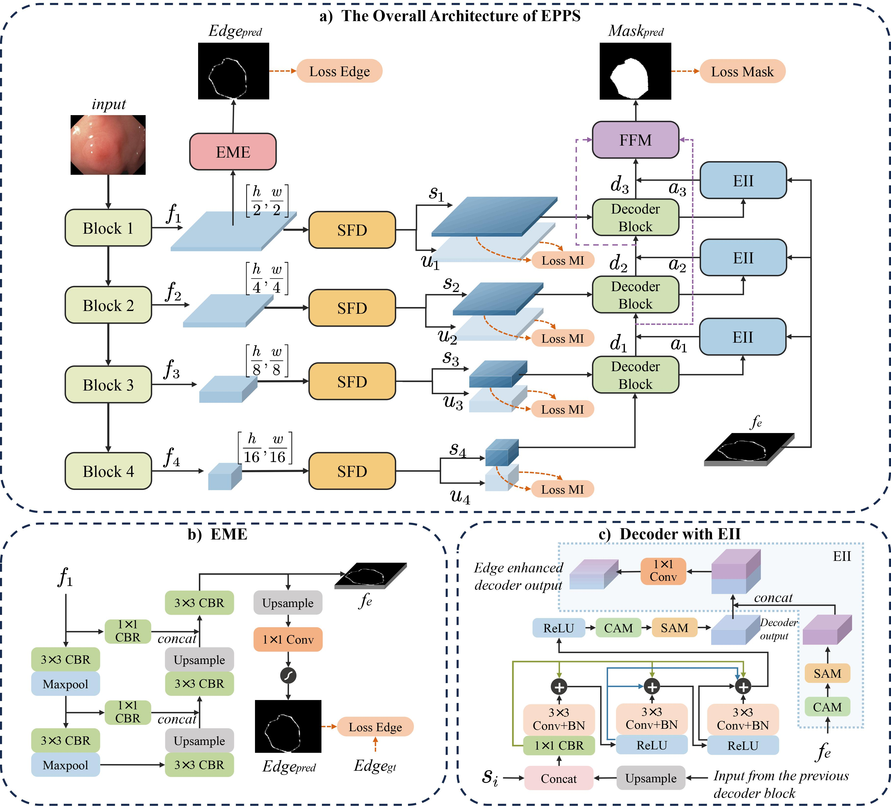
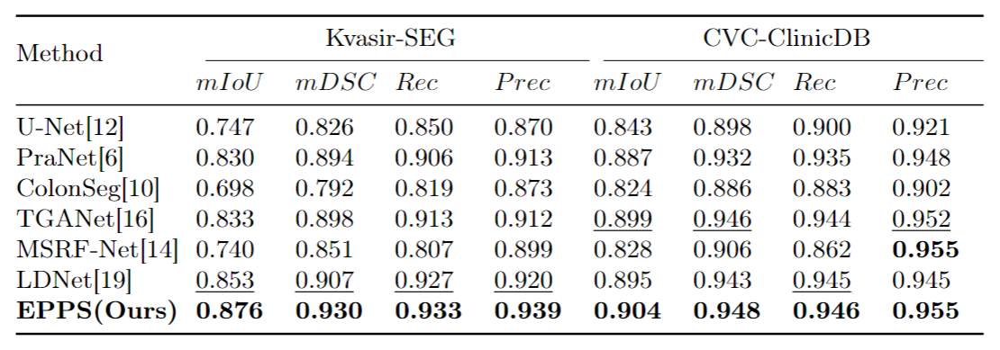
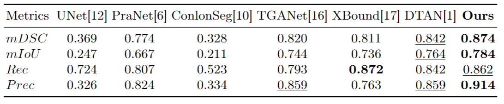
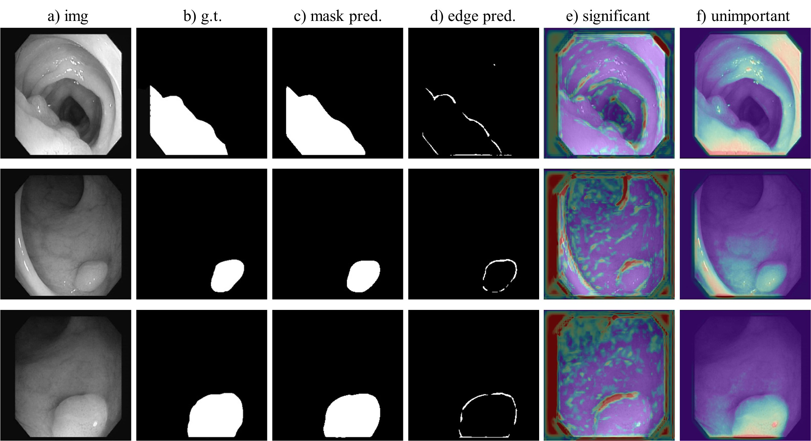

# EPPS: Advanced Polyp Segmentation via Edge Information Injection and Selective Feature Decoupling

## 1. Abstract

Accurate segmentation of polyps in colonoscopy images is essential for early-stage diagnosis and management of colorectal cancer. Despite advancements in deep learning for polyp segmentation, enduring limitations persist. The edges of polyps are typically ambiguous, making them difficult to discern from the background, and the model performance is often compromised by the influence of irrelevant or unimportant features. To alleviate these challenges, we propose a novel model named Edge-Prioritized Polyp Segmentation (EPPS). Specifically, we incorporate an Edge Mapping Engine (EME) aimed at accurately extracting the edges of polyps. Subsequently, an Edge Information Injector (EII) is devised to augment the mask prediction by injecting the captured edge information. Furthermore, we introduce a component called Selective Feature Decoupler (SFD) to suppress the influence of noise and extraneous features on the model. Extensive experiments on 3 widely used polyp segmentation benchmarks demonstrate the superior performance of our method compared with other state-of-the-art approaches.

## 2. Architecture

## 3. Implementation
EPPS is implemented using the PyTorch framework (1.13 + cu11) with a single GeForce RTX 3090 GPU of 24 GB memory. 

We utilized 3 widely used polyp segmentation datasets:
- [Kvasir-SEG](https://datasets.simula.no/downloads/kvasir-seg.zip)
- [CVC-ClinicDB](https://www.dropbox.com/s/p5qe9eotetjnbmq/CVC-ClinicDB.rar?dl=0)
- [Kvasir-Sessile](https://datasets.simula.no/downloads/kvasir-sessile.zip)

We adopt an 8:1:1 split for training, validation, and testing. 

The model can be trained by running train.py, and the results can be tested and visualised by running test.py.

## 3. Results
### 3.1 Comparison with State-of-the-Art Methods
Comparison with other methods on the Kvasir-SEG and CVC-ClinicDB datasets.

Comparison with other methods on the Kvasir-Sessile datasets.

### 3.2 Visualization of EPPS Outputs

